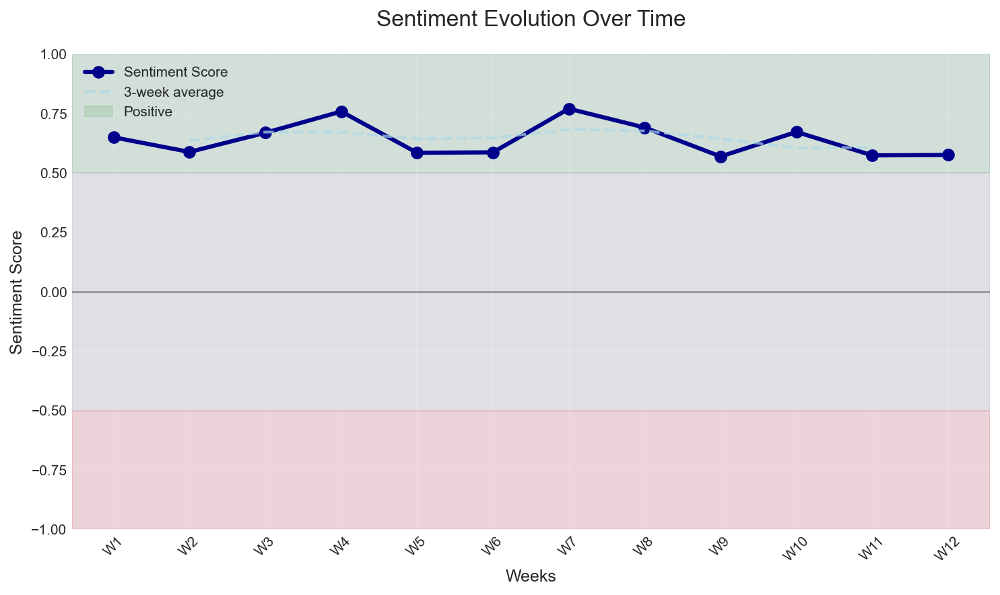

# iMessage Advanced Insights - MCP Server

<div align="center">
  
[](LICENSE)
[](https://www.python.org/downloads/)
[](https://modelcontextprotocol.io/)
[](PRIVACY_SECURITY.md)
[](https://rvp.io)

Transform your iMessage conversations into actionable insights about relationships and communication patterns. A privacy-first MCP server that enables Claude to analyze your messages locally.

**Created by [David Jelinek](https://github.com/davidjelinek) at [Rally Venture Partners](https://rvp.io)**

</div>

## 🎯 What This Does

This MCP server gives Claude the ability to:
- 📊 Analyze relationship health and evolution
- 🎯 Identify optimal contact times
- 🔍 Detect communication anomalies
- 📈 Track sentiment and conversation depth
- 🌐 Map your social network structure
- ☁️ Handle iCloud-stored messages intelligently

All analysis happens locally on your machine. No data ever leaves your computer.

## 🚀 Quick Start

### 1. Install the Server

```bash
# From PyPI (recommended)
pip install imessage-advanced-insights

# Or from source
git clone https://github.com/rallyventurepartners/iMessage_MCPServer_AdvancedInsights.git
cd iMessage_MCPServer_AdvancedInsights
pip install -e .
```

### 2. Configure Claude Desktop

Add to `~/Library/Application Support/Claude/claude_desktop_config.json`:

```json
{
  "mcpServers": {
    "imessage-insights": {
      "command": "python",
      "args": ["-m", "imessage_mcp_server.main"]
    }
  }
}
```

### 3. Grant Full Disk Access

1. Open **System Settings** → **Privacy & Security** → **Full Disk Access**
2. Add Terminal.app (or your terminal of choice)
3. Restart Terminal after granting access

### 4. Restart Claude Desktop

The tools will be available after restart. Grant consent when prompted.

## 🔐 Privacy & Security

<div style="background-color: #f0f8ff; padding: 15px; border-radius: 5px; margin: 20px 0;">

**🔒 Privacy Guarantee**

- ✅ **100% Local Processing**: No network connections, no telemetry
- ✅ **Hashed Identifiers**: All contacts SHA-256 hashed by default  
- ✅ **Consent Required**: Explicit consent for each session (24hr expiry)
- ✅ **Redaction by Default**: PII automatically removed from outputs
- ✅ **Preview Caps**: Message previews limited to 160 characters
- ✅ **Read-Only Access**: Cannot modify or send messages

</div>

## 💡 Use Cases & Example Prompts

### Relationship Analysis
```
You: "Analyze my communication patterns with Sarah over the past 6 months"

Claude: I'll analyze your communication with Sarah. Let me check the patterns...

Based on 847 messages exchanged:
- Response time improved 45% (now averaging 12 minutes)
- Conversation depth increased with longer messages (+28%)
- Peak communication shifted from evenings to lunch hours
- Sentiment trending positive (+0.15 over 6 months)
- You initiate 58% of conversations (well balanced)
```

### Optimal Contact Timing
```
You: "When's the best time to reach John about work matters?"

Claude: Based on John's response patterns:
- **Best times**: Tue-Thu 10-11 AM (87% response rate within 30min)
- **Good times**: Mon/Fri 2-3 PM (72% response rate)
- **Avoid**: Evenings and weekends (<30% response rate)
```

### Communication Health Check
```
You: "How healthy are my closest relationships based on messaging patterns?"

Claude: Analyzing your top 5 contacts by message volume...

✅ Strong indicators:
- Balanced conversation ratios (45-55% initiation)
- Consistent communication (no gaps >7 days)
- Positive sentiment trends in 4/5 relationships

⚠️ Areas to consider:
- Contact "hash:a3f2..." showing decreased frequency (-40%)
- Consider reaching out to reconnect
```

### Network Intelligence
```
You: "Who are the key connectors in my social network?"

Claude: Based on group chat analysis:

Key connectors (bridge multiple groups):
1. hash:b7c9... - Present in 8 different groups
2. hash:f2a1... - Connects work and personal circles
3. hash:d4e8... - Central to family communications
```

### Anomaly Detection
```
You: "Have there been any unusual communication patterns recently?"

Claude: Detected 3 anomalies in the past 30 days:

1. Unusual silence with hash:c8d2... (normally daily contact)
2. Spike in late-night messages (2-4 AM) last week
3. New contact with sudden high volume (possible spam/scam)
```

### Life Event Detection
```
You: "Can you identify any major life events from my conversation patterns?"

Claude: Potential life events detected:

- Mid-September: Surge in "congratulations" messages (possible achievement)
- October: Travel-related keywords spike (trip/vacation?)
- November: Increased family communication (+60%)
```

### Long-Term Analytics with Visualizations
```
You: "Show me my communication patterns with Sarah over the past 3 years with charts"

Claude: I'll analyze your 3-year communication history with Sarah and generate visualizations.

Based on 36 months of data (8,247 messages):

📊 Key Insights:
- Overall trend: Increasing (+2.3 messages/month average growth)
- Current average: 18.5 messages/day (up from 12.1 three years ago)
- Communication balance: Very healthy (52% you, 48% Sarah)
- Peak activity: Weekdays 7-9 PM, minimal on Sunday mornings

📈 Visualizations generated:
1. **Time Series Chart**: Shows steady growth with seasonal dips in August
2. **Communication Heatmap**: Most active Tue-Thu evenings
3. **Balance Chart**: Consistently balanced throughout the period

The relationship shows strong, sustained growth with excellent reciprocity.
```

### Multi-Contact Comparison
```
You: "Compare my messaging patterns across my top 5 contacts over 6 months"

Claude: Analyzing communication patterns across your top 5 contacts...

📊 Comparative Analysis (6 months):
1. Sarah: 3,421 messages (19.0/day) - Most active, very balanced
2. Work Team: 2,156 messages (11.9/day) - Weekday focused
3. Mom: 1,832 messages (10.2/day) - Evening calls trigger text follow-ups
4. John: 987 messages (5.5/day) - Declining trend (-30%)
5. College Group: 743 messages (4.1/day) - Burst pattern around events

Key Observations:
- Sarah represents 35% of your total messaging
- Work communications drop 95% on weekends
- Consider reaching out to John (declining engagement)

[Visualization shows overlaid time series for all 5 contacts]
```

## 🛠️ Available MCP Tools

### Core Tools (25 Total)

*Note: Tools marked with * now include enhanced features like extended time periods (up to 36 months), visualizations, and time series data when requested.*

| Tool | Purpose | Privacy Level |
|------|---------|---------------|
| **Consent Management** | | |
| `request_consent` | Request access permission | Required first |
| `check_consent` | Verify active consent | No data access |
| `revoke_consent` | Revoke access | Clears consent |
| **System Tools** | | |
| `imsg_health_check` | Verify database access | No message access |
| `imsg_summary_overview` | Global statistics | Hashed contacts only |
| `imsg_contact_resolve` | Resolve contact IDs | Hash mapping only |
| **Analysis Tools** | | |
| `imsg_relationship_intelligence` | Deep relationship analysis + visualizations* | Metadata only |
| `imsg_conversation_quality` | Multi-dimensional quality scoring | Aggregated metrics |
| `imsg_relationship_comparison` | Compare multiple relationships | Patterns only |
| `imsg_conversation_topics` | Topic extraction | Keywords only |
| `imsg_sentiment_evolution` | Emotional pattern tracking | Scores only |
| `imsg_response_time_distribution` | Response pattern analysis | Timing only |
| `imsg_cadence_calendar` | Communication heatmaps + time series* | Frequency only |
| **Advanced Analytics** | | |
| `imsg_best_contact_time` | Optimal contact predictions | Pattern-based |
| `imsg_anomaly_scan` | Detect unusual patterns | Statistical only |
| `imsg_network_intelligence` | Social network analysis | Structure only |
| `imsg_sample_messages` | Get message samples | Heavily redacted |
| `imsg_group_dynamics` | Analyze group chat dynamics | Participation only |
| `imsg_predictive_engagement` | ML-powered future predictions | Pattern-based |
| **Cloud-Aware Tools** | | |
| `imsg_cloud_status` | Check iCloud storage status | No message access |
| `imsg_smart_query` | Adaptive querying | Confidence scores |
| `imsg_progressive_analysis` | Partial data analysis | Quality metrics |
| **ML-Powered Tools** (Optional) | | |
| `imsg_semantic_search` | Natural language search | Requires ML deps |
| `imsg_emotion_timeline` | Emotion tracking | Requires ML deps |
| `imsg_topic_clusters` | Topic discovery | Requires ML deps |

[📚 Full Tool Reference →](docs/MCP_TOOLS_REFERENCE.md)

## 📊 Sample Outputs & Visualizations

### Relationship Intelligence Output
```json
{
  "contact_id": "hash:a3f2b8c9",
  "messages_total": 842,
  "sent_pct": 56.2,
  "median_response_time_s": 410,
  "avg_daily_msgs": 2.9,
  "streak_days_max": 23,
  "last_contacted": "2025-08-18T22:14:03Z",
  "engagement_score": 0.87,
  "engagement_trend": "increasing",
  "flags": ["balanced-communicator", "high-engagement"]
}
```

### Conversation Quality Score
```json
{
  "contact_id": "hash:def456",
  "overall_score": 87.5,
  "grade": "B+",
  "trajectory": "improving",
  "dimensions": {
    "depth": {"score": 82.0, "insights": ["Ask more questions to deepen engagement"]},
    "balance": {"score": 91.0, "insights": ["Great mutual engagement"]},
    "emotion": {"score": 88.0, "insights": ["Express emotions more openly"]},
    "consistency": {"score": 89.0, "insights": ["Very active communication - well done!"]}
  },
  "action_items": [
    "Ask more questions to deepen engagement",
    "Express emotions more openly",
    "Your conversation quality is excellent - keep it up!"
  ]
}
```

### Relationship Comparison
```json
{
  "contacts_analyzed": 5,
  "overview": {
    "healthiest_relationship": "hash:abc123",
    "highest_quality_score": 92.3,
    "most_active_relationship": "hash:xyz789",
    "average_quality_score": 78.6
  },
  "relationship_clusters": [
    {
      "type": "inner_circle",
      "size": 2,
      "members": ["hash:abc123", "hash:def456"],
      "characteristics": ["High quality relationships", "Deep, meaningful conversations"]
    },
    {
      "type": "regular_contact",
      "size": 3,
      "members": ["hash:ghi789", "hash:jkl012", "hash:mno345"],
      "characteristics": ["Moderate quality relationships", "Well-balanced communication"]
    }
  ],
  "insights": {
    "patterns": ["2 relationships in your inner circle", "Consistent relationship quality across contacts"],
    "recommendations": ["Consider re-engaging with 1 dormant relationship"],
    "strengths": ["Strong balance across relationships"]
  }
}
```

### Group Dynamics Analysis
```json
{
  "group_id": "hash:work_team_chat",
  "participant_count": 5,
  "message_count": 1247,
  "group_personality": "collaborative_active",
  "dynamics": {
    "participation": {
      "balance_score": 0.78,
      "roles": {
        "most_active": "member_001",
        "conversation_starters": ["member_001", "member_003"]
      }
    },
    "influence": {
      "key_members": {
        "influencers": ["member_001", "member_002"],
        "connectors": ["member_003"]
      },
      "network_density": 0.65
    },
    "health": {
      "health_score": 84.2,
      "inclusivity_score": 76.5,
      "engagement_trend": "stable"
    }
  }
}
```

### Predictive Engagement Forecast
```json
{
  "contact_id": "hash:xyz789",
  "predictions": {
    "response_time": {
      "best_times_to_contact": [
        {"hour": 10, "day": "Tuesday", "response_time_minutes": 8.5},
        {"hour": 14, "day": "Thursday", "response_time_minutes": 12.3}
      ],
      "prediction_confidence": "high"
    },
    "activity_level": {
      "current_daily_average": 4.2,
      "predicted_daily_average": 3.8,
      "trend": "stable"
    },
    "relationship_risk": {
      "risk_level": "low",
      "risk_score": 0.15
    }
  },
  "engagement_strategies": {
    "timing": ["Contact on Tuesday around 10:00 for fastest response"],
    "frequency": ["Maintain current communication frequency"],
    "warnings": []
  }
}
```

### Enhanced Time Series Analysis
```json
{
  "contact_id": "hash:abc123",
  "time_period": "36m",
  "granularity": "monthly",
  "total_messages": 15234,
  "daily_average": 14.1,
  "time_series": {
    "primary": {
      "2023-01": {"total": 412, "sent": 198, "received": 214},
      "2023-02": {"total": 389, "sent": 201, "received": 188},
      "2023-03": {"total": 445, "sent": 220, "received": 225}
    }
  },
  "statistics": {
    "mean": 415.3,
    "median": 412.0,
    "trend_direction": "increasing",
    "weekly_pattern_strength": 0.32
  },
  "visualizations": {
    "time_series_chart": "data:image/png;base64,iVBORw0KGgoAAAANS...",
    "heatmap_chart": "data:image/png;base64,iVBORw0KGgoAAAANS...",
    "balance_chart": "data:image/png;base64,iVBORw0KGgoAAAANS..."
  }
}
```

### Visualization Examples

#### Communication Volume Over Time
The enhanced tools generate matplotlib/seaborn visualizations that show:
- **Time Series Trends**: Message volume with rolling averages
- **Multi-Contact Comparison**: Compare up to 5 contacts simultaneously
- **Granular Analysis**: Hourly, daily, weekly, or monthly aggregations

#### Communication Heatmap

*Hour-by-day heatmap showing when conversations typically occur*

#### Message Balance Analysis

*Sent vs received messages and communication balance over time*

#### Relationship Dashboard

*Comprehensive relationship metrics including volume, balance, and engagement scores*

### Sentiment Evolution

*Tracking emotional tone across multiple relationships over time*

### Communication Heatmap

*Hour-by-day visualization of message frequency patterns*

### Social Network Graph  

*Identifying key connectors and community clusters*

### Response Time Distribution

*Understanding communication rhythms and expectations*

## 🚀 Performance & Scalability

| Database Size | Health Check | Overview | Analysis | Memory Usage |
|--------------|--------------|----------|----------|--------------|
| < 1 GB | < 50ms | < 200ms | < 500ms | < 100 MB |
| 1-10 GB | < 100ms | < 500ms | < 1s | < 250 MB |
| 10-50 GB | < 200ms | < 1s | < 2s | < 500 MB |
| 50+ GB | Use sharding | < 2s | < 5s | < 1 GB |

**Performance Features:**
- Connection pooling with automatic retry
- Query result caching (5 min TTL)
- Streaming processing for large datasets
- Automatic database sharding for 20GB+ databases
- Memory monitoring with automatic limits

## 🚧 Limitations & Troubleshooting

### Known Limitations
- **macOS only** (requires access to iMessage SQLite database)
- **Read-only access** (cannot send or modify messages)
- **iCloud Messages**: Limited local availability (use cloud-aware tools)
- **Group chats**: Some metadata may be incomplete
- **Attachments**: Not analyzed (privacy by design)

### Common Issues

#### "Database not found" Error
```bash
# Verify database exists
ls -la ~/Library/Messages/chat.db

# Check Full Disk Access is granted
# System Settings → Privacy & Security → Full Disk Access
```

#### "99% messages in iCloud"
```bash
# Check cloud status
python -m imessage_mcp_server.tools.cloud_aware --status

# Force download from iCloud
brctl download ~/Library/Messages/
```

#### "No active consent"
Always request consent first in Claude:
```
"I need to analyze my messages, please request consent"
```

#### Performance Issues
```bash
# Run optimization
python scripts/add_performance_indexes.py

# Enable sharding for large databases
python scripts/shard_large_database.py --db chat.db
```

[🔧 Full Troubleshooting Guide →](docs/TROUBLESHOOTING.md)

## 🤝 Contributing

We welcome contributions! Key areas:

- 🔒 **Privacy enhancements**: Better redaction, anonymization
- ⚡ **Performance**: Query optimization, caching strategies  
- 🧠 **Analytics**: New insight algorithms, ML models
- 🌍 **Internationalization**: Support for non-English analysis
- 📱 **Cross-platform**: WhatsApp, Telegram integration

See [CONTRIBUTING.md](CONTRIBUTING.md) for guidelines.

## 📚 Documentation

- [Setup Guide](SETUP_GUIDE.md) - Detailed installation instructions
- [Tool Reference](docs/MCP_TOOLS_REFERENCE.md) - Complete tool documentation
- [Cloud-Aware Tools](docs/CLOUD_AWARE_TOOLS.md) - Handling iCloud storage
- [Large Database Guide](docs/LARGE_DATABASE_GUIDE.md) - Performance optimization
- [Privacy & Security](PRIVACY_SECURITY.md) - Security architecture
- [API Reference](https://github.com/rallyventurepartners/iMessage_MCPServer_AdvancedInsights/wiki)

## 📈 Roadmap

- [ ] Real-time analysis dashboard
- [ ] Export insights to PDF/CSV
- [ ] Conversation coaching suggestions
- [ ] Mental health indicators
- [ ] Cross-platform message sources
- [ ] Team/family analytics

## 👨‍💻 Credits

Created and maintained by **[David Jelinek](https://github.com/davidjelinek)** at **[Rally Venture Partners](https://rvp.io)**

- **Author**: David Jelinek (david@rvp.io)
- **Organization**: Rally Venture Partners
- **Website**: [rvp.io](https://rvp.io)

## 📜 License

MIT License - see [LICENSE](LICENSE) for details.

Copyright © 2025 David Jelinek / Rally Venture Partners / rvp.io

## 🙏 Acknowledgments

- Built on [Model Context Protocol](https://modelcontextprotocol.io/) by Anthropic
- Visualization libraries: Matplotlib, Seaborn, NetworkX
- Privacy-preserving techniques from differential privacy research

---

<div align="center">
  Made with ❤️ for privacy-conscious communication analysis
</div>